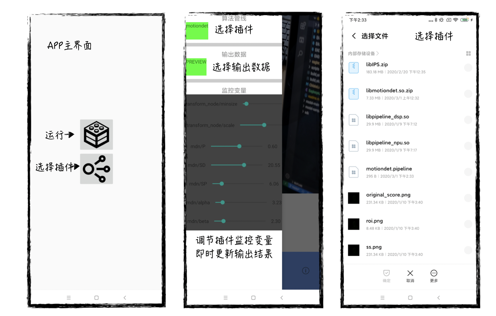

#EAGLEEYE APP集成
----
#### EAGLEEYE APP简介

依靠EAGLEEYE插件框架构建DEMO APP，主要用于快速验证、展示算法效果，加速算法迭代速度。按照EAGLEEYE插件框架构建的标准插件，可以通过APP主界面的选择插件按钮进行加载。APP可以同时管理多组插件，随时进行插件切换和监控参数调整。目前，APP可以支持图像应用、视频应用和相机应用（通过在构建算法管道时指定数据源类型设置）。

**EAGLEEYE APP即将开源**
#### 算法插件创建
使用在EAGLEEYE插件框架中引入的例子——movingdet。在构建插件时，仅需要为输入节点和输出节点分别指定输出目标和数据类型即可完成和APP的对接。具体代码如下
```c++
  EAGLEEYE_BEGIN_PIPELINE_INITIALIZE(movingdet)
  // 实现算法处理管线搭建（详见数据流编程框架介绍）
  // 第一步：定义数据源，用以接收外部传入的数据
  Placeholder<ImageSignal<Array<unsigned char,3>>>* data_source = 
              new Placeholder<ImageSignal<Array<unsigned char,3>>>();
  // 设置数据源类型
  data_source->setPlaceholderType(EAGLEEYE_SIGNAL_IMAGE);
  // 设置数据源目标（这里指定EAGLEEYE_CAPTURE_PREVIEW_IMAGE，表明从相机预览流中获取数据）
  data_source->setPlaceholderSource(EAGLEEYE_CAPTURE_PREVIEW_IMAGE);
  
  // 第二步：定义数据变换节点，resize到指定大小
  ImageTransformNode* image_transform_node = new ImageTransformNode(false);
  image_transform_node->setMinSize(96);
  
  // 第三步：光流计算节点
  OpticalFlowNode* optical_flow = new OpticalFlowNode();
  optical_flow->setBRIEFSamplingRad(7);
  optical_flow->setRandomSearchRad(5);
  optical_flow->setMedianFSize(3);
  
  // 第四步：运动检测节点
  MovingDetNode* mdn = new MovingDetNode();
  
  // 第五步：将运动检测输出结果转变为可视化结果（运动位置以矩形输出）
  AdaptorNode* adaptor_node = new AdaptorNode(2,1, grid_split_func);
  adaptor_node->configureOutputSignal<ImageSignal<int>>(0);
  // 设置输出数据类型（EAGLEEYE_SIGNAL_RECT表明输出的是矩形）
  adaptor_node->getOutputPort(0)->setSignalType(EAGLEEYE_SIGNAL_RECT);

  // 第六步：将处理节点加入算法管线（movingdet）
  movingdet->add(data_source, "source");
  movingdet->add(image_transform_node, "image_transform_node");
  movingdet->add(optical_flow, "optical_flow");
  movingdet->add(mdn, "mdn");
  movingdet->add(adaptor_node, "adaptor"); 

  // 第七步：将处理节点建立关联，构建管线
  movingdet->bind("source",0, "image_transform_node", 0);
  movingdet->bind("image_transform_node", 0, "mdn", 0);
  movingdet->bind("image_transform_node", 0, "optical_flow", 0);
  movingdet->bind("optical_flow",0,"mdn", 1);
  motiondet->bind("data_source",0,"adaptor",0);
  motiondet->bind("mdn", 0, "adaptor",1);  
  EAGLEEYE_END_PIPELINE_INITIALIZE
```

数据源获取目标目前支持：
* EAGLEEYE_CAPTURE_STILL_IMAGE
    从相机中获得拍照图像数据
* EAGLEEYE_PHOTO_GALLERY_IMAGE
    从相册中获得图像数据
* EAGLEEYE_CAPTURE_PREVIEW_IMAGE
    从相机预览流中获取图像数据
* EAGLEEYE_CAPTURE_CLICK
    获得点击位置数据
* EAGLEEYE_CAPTURE_LINE
    获得手指绘制的直线数据
* EAGLEEYE_CAPTURE_RECT
    获得手指绘制的矩形数据
* EAGLEEYE_CAPTURE_POINT
    获得手指点击数据
* EAGLEEYE_CAPTURE_MASK
    会的手指涂抹的mask数据
* EAGLEEYE_CAPTURE_VIDEO_IMAGE
    从所加载的视频中获得图像数据

输入数据和输出数据目前支持的类型：
* EAGLEEYE_SIGNAL_IMAGE
    图像类型数据：ImageSignal\<Array\<unsigned char,3\>\>
* EAGLEEYE_SIGNAL_RECT
    矩形类型数据：ImageSignal\<int\>
    $$\begin{matrix}x&y&w&h\\x&y&w&h\\\vdots&\vdots&\vdots&\vdots\end{matrix}$$
* EAGLEEYE_SIGNAL_LINE
    直线类型数据：ImageSignal\<int\>
    $$\begin{matrix}x_1&y_1&x_2&y_2\\x_1&y_1&x_2&y_2\\\vdots&\vdots&\vdots&\vdots\end{matrix}$$
* EAGLEEYE_SIGNAL_POINT
    点类型数据：ImageSignal\<int\>
    $$\begin{matrix}x&y\\x&y\\\vdots&\vdots\end{matrix}$$
* EAGLEEYE_SIGNAL_MASK
    掩模数据类型：ImageSignal\<unsigned char\>

