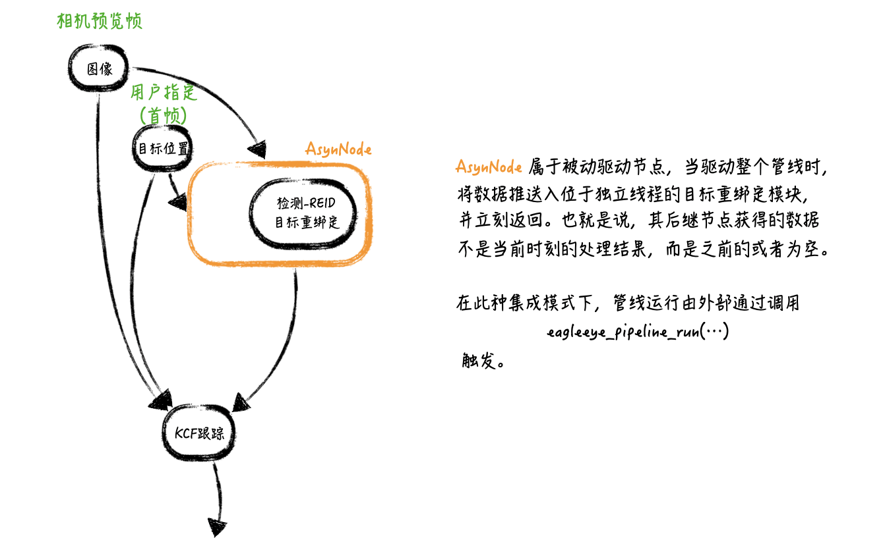
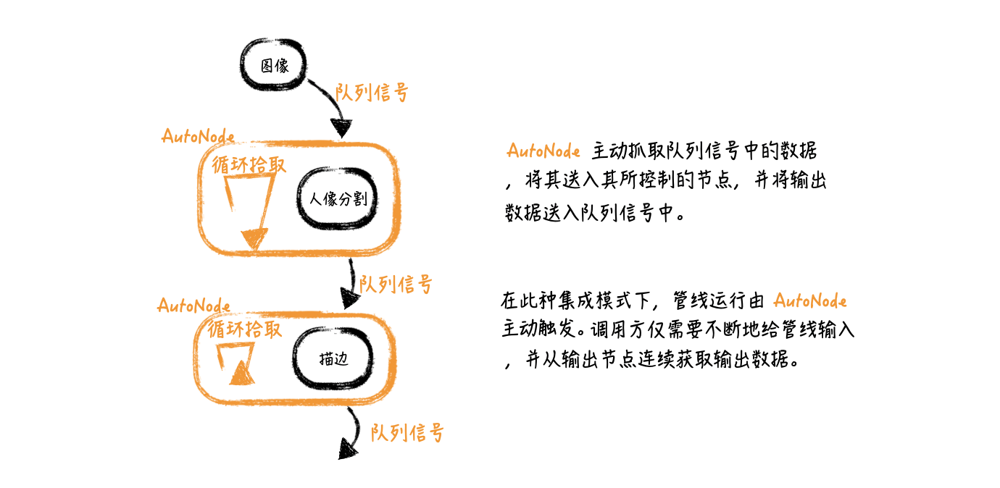
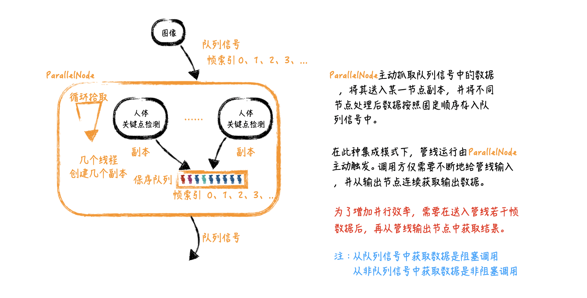
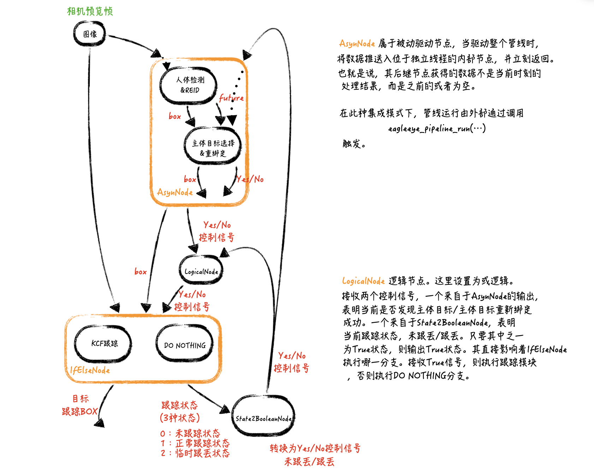
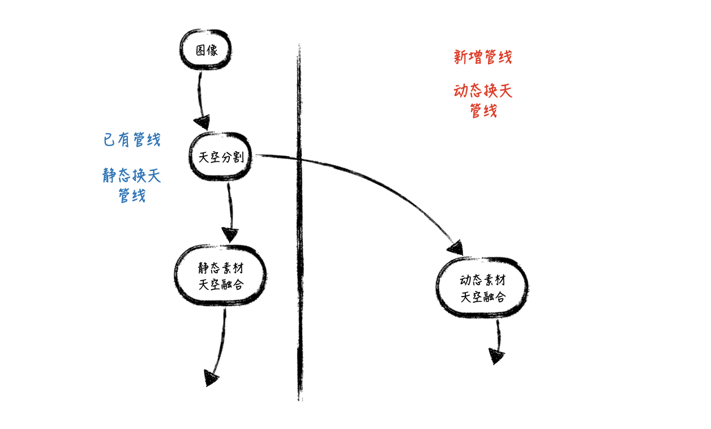

#EAGLEEYE-CODEBOOK
----
* 项目1——常规处理管线
    * 简介
    * 逻辑框图
    * 源码
        [源码](./code/project_1.cpp)
* 项目2——异步处理管线
    * 简介
        这是一个相机预览应用，负责将从相机获取的预览帧数据中对指定的人体进行跟踪（强实时应用）。整个算法分为两个模块，(1) 人体检测及REID模块，负责目标重绑定，效率较低但精度高；（2）KCF目标跟踪模块，效率高但精度较低，易跟丢。考虑到强实时应用，不可能对每一帧数据均进行目标重绑定计算，故需要将此模块置于AsynNode节点下，实现非阻塞调用。从而这个算法的计算逻辑变为，对每一帧均进行目标跟踪，如若发现目标重绑定模块有数据输出，则对目标位置进行修正。
    * 逻辑框图
        
    * 源码
        [源码(project_2.cpp)](./code/project_2.cpp)
* 项目3——并行处理1
    * 简介
        这是一个视频应用，负责将视频中的每一帧中的人像区域分割出来，并基于人像边缘位置进行描边。整个算法分为两个模块，（1）人像分割模块，使用前后帧信息增强分割模型的帧间稳定性；（2）人像描边模块。为了增加计算效率，采用两个模块的并行处理方案（基于AutoNode节点实现）。

    * 逻辑框图
        
    * 源码
        [源码(project_3.cpp)](./code/project_3.cpp)
    
* 项目4——并行处理2
    * 简介
        这是一个相机预览应用，负责将从相机获取的预览帧数据中进行人体骨架关键点定位并输出（弱实时应用——允许延迟若干帧）。这里采用多线程并行方案（基于ParallelNode节点实现）。将人体关键点检测节点交于ParallelNode节点接管，根据设置的多线程数自动构建创建对应副本。主动拾取输入队列信号中的数据，进行并行处理，并实现保序输出到队列中。在外部调用时，允许持续将相机预览帧数据放入管道中，根据实际情况在几帧数据后再从管道的输出节点中拾取数据（当然，此时并非完全实时处理，会存在若干帧延迟）。
        注：并行执行其实是在这延迟的若干帧中进行。

    * 逻辑框图
        
    * 源码
        [源码(project_4.cpp)](./code/project_4.cpp)
* 项目5——复杂管线
    * 简介
        这是一个相机预览应用，负责对从相机获取的预览帧数据中主体人物进行跟踪（强实时应用）。主体人物的判别完全由算法决定，在这里通过人体检测模块获取的人体区域，最大人体目标即为主体目标。整个算法主要由三个模块组成，（1）目标检测；（2）主体目标选择/目标重绑定；（3）目标跟踪。由于主体目标的动态变化（在跟丢后需要重新选择），管线内部需要自动根据状态变化实现不同功能。例如，当发生跟丢后，需要重启主体目标选择。为了实现强实时能力，需要使用AsynNode对目标检测及主体目标选择/重绑定进行封装。
    * 逻辑框图
        
    * 源码
        [源码(project_5.cpp)](./code/project_5.cpp)
* 项目6——基于已有管线中间节点
    * 简介
        这是一个相册应用（魔法换天）的简化版。现有的魔法换天管线，由两个模块组成（1）天空分割模块，将天空区域分割出来；（2）天空素材融合，将静态素材天空和前景区域融合。新管线将实现动态素材天空效果，想要直接使用来自已有管线的天空分割节点的输出结果。
    * 逻辑框图
        
    * 源码
        [源码(project_6.cpp)](./code/project_6.cpp)