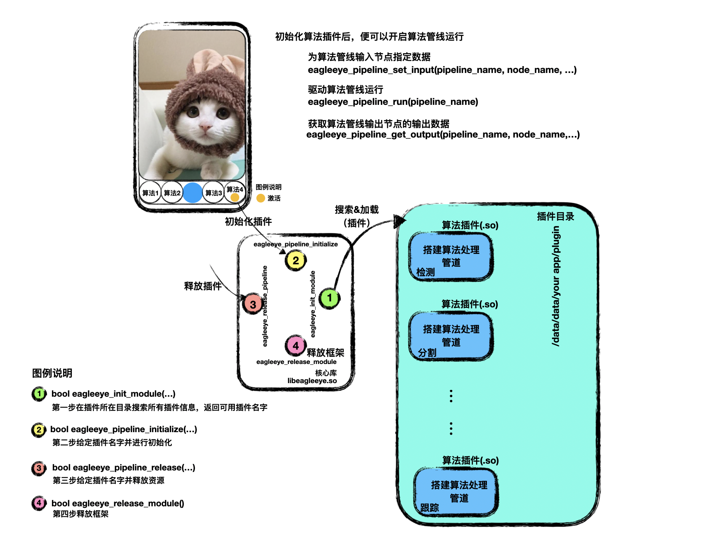

# EAGLEEYE插件框架
---
#### 简介
基于AI算法加持的应用，多人协同和小步迭代式是最常见的开发模式。统一的模块接口定义和模块动态更新是快速推动算法落地的必要前提。EAGLEEYE所提供的数据流管道框架和插件框架为大规模算法落地提供了基础平台。

#### 插件管理机制

在EAGLEEYE中依靠dlopen/dlsym实现动态加载插件过程。开发者开发的算法插件统一放置于预定义的插件目录，比如

```c++
/data/data/your app/plugin/
```

在EagleeyeModule.h中定义了所有插件管理的接口函数，包括
* 初始化插件框架
    
    ```c++
    bool eagleeye_init_module(std::vector<std::string>& pipeline_names, const char* plugin_folder);
    ```
    
    参数：
    * plugin_folder指定存放插件的目录
    * pipeline_names获得返回的符合要求的插件名字

    说明：
    调用此函数获得所有符合要求的插件列表

* 插件初始化

    ```c++
    bool eagleeye_pipeline_initialize(const char* pipeline_name);
    ```

    参数：
    * pipeline_name 设置需要初始化的插件名字

    说明：
    初始化插件资源。当需要调用算法插件前，进行调用。

* 释放插件资源

    ```c++
    bool eagleeye_pipeline_release(const char* pipeline_name);
    ```

    参数：
    * pipeline_name设置需要释放的插件名字
    
    说明：
    释放插件资源。当退出当前算法插件时，进行调用。

* 释放插件框架

    ```c++
    bool eagleeye_release_module()；
    ```

    说明：
    释放插件框架。当全局退出时，进行调用。

#### 算法插件创建
下面的例子是示例工程中的运动检测算法插件（来自eagleeye/model-sample/movingdet_plugin.cpp）。

编写算法插件，只需依靠在EagleeyeModule.h中定义的宏便可轻松完成：

* 定义插件注册函数
    ```c++
    EAGLEEYE_PIPELINE_REGISTER(pipeline, version, key);
    ```
    
    参数：
    * pipeline 定义插件名字
    * version 定义插件版本
    * key 定义申请的插件签名（目前暂未启用）

    在movingdet_plugin.cpp中的调用方式如下

    ```c++
    EAGLEEYE_PIPELINE_REGISTER(movingdet, 1.0, xxxxxxx);
    ```

* 定义插件初始化函数
    ```c++
    EAGLEEYE_BEGIN_PIPELINE_INITIALIZE(movingdet)
    // 实现算法处理管线搭建（详见数据流编程框架介绍）
    // 第一步：定义数据源，用以接收外部传入的数据
    Placeholder<ImageSignal<Array<unsigned char, 3>>>* data_source = 
                new Placeholder<ImageSignal<Array<unsigned char, 3>>>();
    data_source->setPlaceholderType(EAGLEEYE_SIGNAL_IMAGE);
    data_source->setPlaceholderSource(EAGLEEYE_CAPTURE_PREVIEW_IMAGE);
    
    // 第二步：定义数据变换节点，resize到指定大小
    ImageTransformNode* image_transform_node = new ImageTransformNode(false);
    image_transform_node->setMinSize(96);
    
    // 第三步：光流计算节点
    OpticalFlowNode* optical_flow = new OpticalFlowNode();
    optical_flow->setBRIEFSamplingRad(7);
    optical_flow->setRandomSearchRad(5);
    optical_flow->setMedianFSize(3);
    
    // 第四步：运动检测节点
    MovingDetNode* mdn = new MovingDetNode();
    
    // 第五步：将处理节点加入算法管线（movingdet）
    movingdet->add(data_source, "source", SOURCE_NODE);
    movingdet->add(image_transform_node, "image_transform_node");
    movingdet->add(optical_flow, "optical_flow");
    movingdet->add(mdn, "mdn", SINK_NODE);
    
    // 第六步：将处理节点建立关联，构建管线
    movingdet->bind("source",0, "image_transform_node", 0);
    movingdet->bind("image_transform_node", 0, "mdn", 0);
    movingdet->bind("image_transform_node", 0, "optical_flow", 0);
    movingdet->bind("optical_flow",0,"mdn", 1);
    EAGLEEYE_END_PIPELINE_INITIALIZE
    ```

#### 通用算法插件集成/调用
##### 插件集成关键接口分析
* 插件搜索及初始化
    ```c++
    // 第一步：在插件搜索路径中，检索所有插件
    // 在APP下，仅允许将插件置于/data/data/APP/下，否则android系统不允许动态加载动态库
    std::vector<std::string> pipeline_names;
    eagleeye_init_module(pipeline_names, "/data/local/tmp/eagleeye/plugin/");
    // 第二步：初始化指定插件
    pipeline_name = pipeline_names[0];
    eagleeye_pipeline_initialize(pipeline_name.c_str());
    // 第三步：设置插件参数（底层依靠）
    // 第一个参数为插件名称
    // 第二个参数为计算网络图中的计算节点名字
    // 第三个参数为计算节点中的监控变量（见数据流编程框架细节）
    // 第四个参数为监控变量设置新数值
    int k = 6;
    eagleeye_pipeline_set_param(pipeline_name.c_str(), "mdn", "K",&k);

    ```
* 插件运行
    包括管线输入、运行和输出
    * 设置管线输入

        ```c++
        char* in_data_name = "source";          // 占位节点名字（在构建管线时，Placeholder指定的名字）
        void* in_data = ...;                    // 数据指针
        int in_data_size[] = {rows, cols, 3};   // 数据形状
        int in_data_type = ...;                 // 数据类型
        eagleeye_pipeline_set_input(pipeline_name.c_str(), in_data_name, in_data, in_data_size, 3, in_data_type);
        ```
    * 检查管线是否满足运行条件
        ```c++
        bool is_ready = false;
        eagleeye_pipeline_isready(pipeline_name.c_str(), is_ready);
        ```
        如果返回is_ready==true，表明管线处在可运行状态，反之处在不可运行状态。
        注：只有当所有占位节点均设置了输入，管线才处在可运行状态。
    * 管线运行

        ```c++
        bool status = false;
        status = eagleeye_pipeline_run(pipeline_name.c_str());
        ```
        当返回状态status==true，则说明管线输出节点数据发生更新。否则输出节点数据无变化。
    * 获得管线输出

        ```c++
        char* out_data_name="mdn/0";    //输出节点名字/端口号
        void* out_data;                 //输出数据指针
        int out_data_size[3];           //数据尺寸
        int out_data_dims=0;            //数据维度
        int out_data_type=0;            //数据类型
        eagleeye_pipeline_get_output(pipeline_name.c_str(), out_data_name, out_data, out_data_size, out_data_dims, out_data_type);
        ```
        
        其中，out_data获得的数据指针；out_data_size获得的数据大小包括高、宽、通道数；out_data_type数据类型。
        数据类型定义如下
        |数据类型|值|
        |----|----|
        |char|0|
        |unsigned char|1|
        |short|2|
        |unsigned short|3|
        |int|4|
        |unsigned int|5|
        |float|6|
        |double|7|
        |Array<unsigned char,3>|8|
        |Array<unsigned char,4>|9|
        |std::string|10|
    * 管线状态重置
        ```c++
        eagleeye_pipeline_reset(pipeline_name.c_str());

        ```
        管线状态重置，将驱动管线中所有数据处理节点清除所有中间状态信息。（常用在视频处理算法中）

* 插件注销及模块注销
    ```c++
    // 第一步：释放插件
    eagleeye_pipeline_release(pipeline_name.c_str());
    // 第二步：释放模块
    eagleeye_release_module();
    ```

##### 插件集成其余接口分析
* 插件版本号
    ```c++
    char* pipeline_version = (char*)malloc(1024);
    eagleeye_pipeline_version(pipeline_name.c_str(), pipeline_version);
    ```
    获得指定插件的版本编号（x.x.x.x）。

* 插件中可配置参数列表
    ```c++
    // 函数原型
    // bool eagleeye_pipeline_get_monitor_config(const char* pipeline_name,
    //                                           std::vector<std::string>& monitor_names,
    //                                           std::vector<int>& monitor_types,
    //                                           std::vector<std::string>& monitor_range);

    std::vector<std::string> monitor_names;
    std::vector<int> monitor_types;
    std::vector<std::string> monitor_range;
    eagleeye_pipeline_get_monitor_config(pipeline_name.c_str(), monitor_names, monitor_types, monitor_range);

    ```
    monitor_names中每个字符串按照node/param格式存储着数据处理节点的名字和对应的参数名字。monitor_types中存储着参数的类型，目前支持的参数类型如下
    |枚举标识|参数类型|值|
    |----|---|----|
    |EAGLEEYE_MONITOR_BOOL|bool|0|
    |EAGLEEYE_MONITOR_INT|int|1|
    |EAGLEEYE_MONITOR_FLOAT|float|2|
    |EAGLEEYE_MONITOR_STR|std::string|3|
    monitor_range中按照min/max格式存储着允许调节的最大最小值。
* 设置/获取参数值
    ```c++
    // 设置参数函数原型
    // bool eagleeye_pipeline_set_param(const char* pipeline_name,
    //                                  const char* node_name, 
    //                                  const char* param_name, 
    //                                  const void* value);
    // bool类型参数类型
    std::string node_name = ...; (可以从上一步中获得的参数列表(node/param)中解析得到)
    std::string param_name = ...; (可以从上一步中获得的参数列表(node/param)中解析得到)
    bool bool_value = true;
    eagleeye_pipeline_set_param(pipeline_name.c_str(), node_name, param_name, &bool_value);

    // int 类型参数类型
    node_name = ...; (可以从上一步中获得的参数列表(node/param)中解析得到)
    param_name = ...; (可以从上一步中获得的参数列表(node/param)中解析得到)
    int int_value = 10;
    eagleeye_pipeline_set_param(pipeline_name.c_str(), node_name, param_name, &int_value);

    // float 类型参数类型
    node_name = ...; (可以从上一步中获得的参数列表(node/param)中解析得到)
    param_name = ...; (可以从上一步中获得的参数列表(node/param)中解析得到)
    float float_value = 10.0f;
    eagleeye_pipeline_set_param(pipeline_name.c_str(), node_name, param_name, &float_value);

    // std::string 类型参数类型
    node_name = ...; (可以从上一步中获得的参数列表(node/param)中解析得到)
    param_name = ...; (可以从上一步中获得的参数列表(node/param)中解析得到)
    std::string str_value = "hello the world";
    eagleeye_pipeline_set_param(pipeline_name.c_str(), node_name, param_name, &str_value);

    // 获取参数函数原型
    // bool eagleeye_pipeline_get_param(const char* pipeline_name,
    //                                  const char* node_name, 
    //                                  const char* param_name, 
    //                                  void* value);
    // bool 类型参数
    node_name = ...; (可以从上一步中获得的参数列表(node/param)中解析得到)
    param_name = ...; (可以从上一步中获得的参数列表(node/param)中解析得到)
    bool bool_value;
    eagleeye_pipeline_get_param(pipeline_name.c_str(), node_name, param_name, &bool_value);

    // int 类型参数
    node_name = ...; (可以从上一步中获得的参数列表(node/param)中解析得到)
    param_name = ...; (可以从上一步中获得的参数列表(node/param)中解析得到)
    int int_value;
    eagleeye_pipeline_get_param(pipeline_name.c_str(), node_name, param_name, &int_value);

    // float 类型参数
    node_name = ...; (可以从上一步中获得的参数列表(node/param)中解析得到)
    param_name = ...; (可以从上一步中获得的参数列表(node/param)中解析得到)
    float float_value;
    eagleeye_pipeline_get_param(pipeline_name.c_str(), node_name, param_name, &float_value);

    // std::string 类型参数
    node_name = ...; (可以从上一步中获得的参数列表(node/param)中解析得到)
    param_name = ...; (可以从上一步中获得的参数列表(node/param)中解析得到)
    std::string str_value;
    eagleeye_pipeline_get_param(pipeline_name.c_str(), node_name, param_name, &str_value);
    ```

* 获取插件输入节点配置
    ```c++
    // 函数原型
    // bool eagleeye_pipeline_get_input_config(const char* pipeline_name,
    //                                         std::vector<std::string>& input_nodes,
    //                                         std::vector<std::string>& input_types,
    //                                         std::vector<std::string>& input_sources);

    std::vector<std::string> input_nodes;
    std::vector<std::string> input_types;
    std::vector<std::string> input_sources;
    eagleeye_pipeline_get_input_config(pipeline_name.c_str(), input_nodes, input_types, input_sources);

    ```
    其中，input_nodes保存着输入节点名字；input_types保存着输入节点数据种类；input_sources保存着数据数据的来源。上层APP需要根据输入数据来源确定插件应用场景，并绑定指定输入数据。
    数据种类定义
    |类型字符串标识|含义|
    |----|----|
    |EAGLEEYE_SIGNAL_IMAGE|图像数据|
    |EAGLEEYE_SIGNAL_RECT|矩形数据（x,y,w,h）|
    |EAGLEEYE_SIGNAL_LINE|直线数据 (x1,y1,x2,y2)|
    |EAGLEEYE_SIGNAL_POINT|点数据（x,y）|

    数据来源定义
    |类型字符串标识|含义|
    |----|----|
    |EAGLEEYE_CAPTURE_STILL_IMAGE|数据来源相机（拍照应用）|
    |EAGLEEYE_PHOTO_GALLERY_IMAGE|数据来源相册|
    |EAGLEEYE_CAPTURE_PREVIEW_IMAGE|数据来源相机预览|
    |EAGLEEYE_CAPTURE_CLICK|数据来源点击|
    |EAGLEEYE_CAPTURE_LINE|数据来源绘制直线|
    |EAGLEEYE_CAPTURE_RECT|数据来源绘制矩形|
    |EAGLEEYE_CAPTURE_POINT|同"EAGLEEYE_CAPTURE_CLICK"|
    |EAGLEEYE_CAPTURE_MASK|数据绘制手指绘制的mask|
    |EAGLEEYE_CAPTURE_VIDEO_IMAGE|数据来源视频|

* 获取插件输出节点配置
    ```c++
    // 函数原型
    // bool eagleeye_pipeline_get_output_config(const char* pipeline_name,
    //                                          std::vector<std::string>& output_nodes,
    //                                          std::vector<std::string>& output_types,
    //                                          std::vector<std::string>& output_targets);

    std::vector<std::string> output_nodes;
    std::vector<std::string> output_types;
    std::vector<std::string> output_targets;
    eagleeye_pipeline_get_output_config(pipeline_name.c_str(), output_nodes, output_types, output_targets);
    ```
    其中，output_nodes存储着输出节点名字，output_types存储着输出节点数据种类（定义见上一节），output_targets输出节点输出位置（定义见上一节，需要上层APP支持）。

* 加载/保存插件参数配置
    ```c++
    // 加载插件参数配置函数原型
    // bool eagleeye_pipeline_load_config(const char* pipeline_name, const char* config_file);
    const char* config_file = "../pipeline_config.bin";
    eagleeye_pipeline_load_config(pipeline_name.c_str(), config_file);


    // 保存插件参数配置函数原型
    // bool eagleeye_pipeline_save_config(const char* pipeline_name, const char* config_file);
    const char* config_file = "../pipeline_config.bin";
    eagleeye_pipeline_save_config(pipeline_name.c_str(), config_file);
    ```


#### 快速生成插件代码模板
使用scripts/main.py快速创建插件模板

```shell
eagleeye-cli project --project=movingdet \\ 定义要生成的插件名字
        --version=1.0.0.0 \\            定义插件版本
        --signature=xxxxx \\            定义插件签名（目前未启用）
        --build_type=Release \\         定义编译版本
        --opencv=OPENCV_PATH \\         定义opencv路径(选择性设置)
        --abi=arm64-v8a \\              定义abi
        --eagleeye=EAGLEEYE_PATH \\     定义eagleeye路径
        --opencl=OPENCL_PATH \\         定义OPENCL路径（选择性设置）
        --neon=true                     定义NEON加速(true/false)
```

运行脚本后将在当前目录下生成以指定的插件名命名的文件夹（这里--project=movingdet），例如
```
movingdet_plugin
    - movingdet_plugin.h
    - movingdet_plugin.cpp
    - movingdet_demo.cpp
    - CMakeLists.txt
    - build.sh
```

开发者可以直接在自动生成的模板下进行插件开发。调用build.sh后，将会构建插件和对应DEMO工程。


#### 特定算法插件集成/调用
在一些特定应用中，不需要支持动态加载插件的能力。此时可以直接使用插件特有接口，实现算法调用。在这种集成方式下，编译出的插件.so文件需要静态链接进工程中。

以上面自动生成的插件模板（movingdet）为例，插件特有接口定义在movingdet_plugin.h中。

```c++
extern "C"{
    /**
     * @brief initialize movingdet pipeline
     * 
     * @return true 
     * @return false 
     */
    bool eagleeye_movingdet_initialize();

    /**
     * @brief release movingdet pipeline
     * 
     * @return true 
     * @return false 
     */
    bool eagleeye_movingdet_release();

    /**
     * @brief run movingdet pipeline
     * 
     * @return true 
     * @return false 
     */
    bool eagleeye_movingdet_run();

    /**
     * @brief get movingdet pipeline version
     * 
     * @param pipeline_version
     * @return true 
     * @return false 
     */
    bool eagleeye_movingdet_version(char* pipeline_version);

    /**
     * @brief reset movingdet pipeline state
     * 
     * @return true 
     * @return false 
     */
    bool eagleeye_movingdet_reset();

    /**
     * @brief set any node param in movingdet pipeline
     * 
     * @param node_name node name in pipeline
     * @param param_name node param in pipeline
     * @param value param value
     * @return true  success to set
     * @return false fail to set
     */
    bool eagleeye_movingdet_set_param(const char* node_name, const char* param_name, const void* value);

    /**
     * @brief get any node param in movingdet pipeline
     * 
     * @param node_name node name in pipeline
     * @param param_name node param in pipeline
     * @param value param value
     * @return true success to get
     * @return false fail to get
     */
    bool eagleeye_movingdet_get_param(const char* node_name, const char* param_name, void* value);

    /**
     * @brief set input data from movingdet input node
     * 
     * @param node_name node name in pipeline
     * @param data data pointer
     * @param data_size dimension (H,W,C)
     * @param data_dims dimension number
     * @param data_type data type
     * @return true 
     * @return false 
     */
    bool eagleeye_movingdet_set_input(const char* node_name, void* data, const int* data_size, const int data_dims, const int data_type);

    /**
     * @brief get output data from movingdet output node
     * 
     * @param node_name node name in pipeline
     * @param data data pointer
     * @param data_size dimension (H,W,C)/(B,H,W,C)
     * @param data_dims dimension number
     * @param data_type data type
     * @return true 
     * @return false 
     */
    bool eagleeye_movingdet_get_output(const char* node_name, void*& data, int* data_size, int& data_dims,int& data_type);
}
```
进入这些针对插件特有接口的实现中可以看到，其内部仅是使用固定的插件名字来调用上一节中对应的通用接口。比如，管线重置函数
```c++
eagleeye_movingdet_reset()
```
其内部的实现是
```c++
    bool eagleeye_movingdet_reset(){ 
        return eagleeye_pipeline_reset("movingdet");
    } 
```
在集成时，依然分为三个步骤

* 插件初始化
    ```c++
    eagleeye_movingdet_initialize();
    ```
* 插件运行
    ```c++
    // 第一步：设置输入
    void* data = image.data;
    int data_size[] = {image.rows, image.cols, 3}; 
    eagleeye_movingdet_set_input("source", data, data_size, 3，8);
    // 第二步：驱动管线运行
    eagleeye_movingdet_run();
    ```
* 插件释放
    ```c++
    eagleeye_movingdet_release();
    ```


#### 插件发布
发布包结构
```
- 插件名字/
    - 插件名字.so
    - 插件名字.ini
    - resource/
        - xxx
        - xxx
```
其中，*.ini是插件部署文件；*.pipeline插件相关参数配置文件；resource是资源文件夹，插件所需的所有资源文件均可以放在这里。
使用zip对发布包进行压缩后发布。

##### 插件部署文件(*.ini)
被框架层加载，并进行相关验证功能。
```
[BASE]
VERSION=
ID=
DEPENDENT_PIPELINE=
INPUT=
OUTPUT=
```

##### 插件资源文件夹(resource/)
放置插件所需资源文件。在代码中通过如下代码，获得资源文件夹。
```
std::string resource_folder = pipeline.resourceFolder();
```
