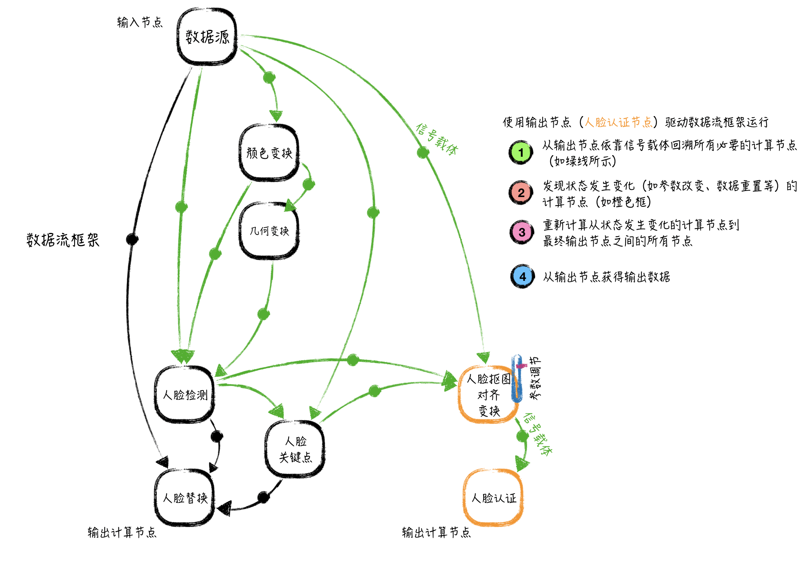

#EAGLEEYE数据流编程框架
_____

####简介

数据流编程框架是一种当前比较流行的架构设计，包括医学图像处理库ITK、数据可视化库VTK、深度学习框架Tensorflow，等都采用类似的架构。通过建立统一的接口标准和模块间的完全解耦合，提高多人协同开发效率并加速算法落地。

####数据流框架原理

数据流框架依靠定义的AnySignal和AnyNode串起所有的计算节点。AnySignal是信号载体的基类，框架中已经基于其创建了图像信号载体ImageSignal和张量信号载体TensorSignal。AnyNode是计算节点的基类，所有算法的实现继承于此类。每个计算节点需要预先指定输入信号个数，以及输出信号类型和个数。一个完整的功能实现，需要多个计算节点联合完成，计算节点之间的关联依靠信号载体建立。

如下代码将节点node_a的第0输出信号与节点node_b的第1输入端口建立联系：
<pre><code>
AnyNode* node_a = new CropFace();
AnyNode* node_b = new FaceVerify();
node_b->setInputPort(node_a->getOutputPort(0), 1);
</code></pre>

依靠类似代码便可建立所有计算节点的连接。

整个计算网路依靠输出节点进行驱动。通过调用
<pre><code>
AnyNode* output_node = ...
output_node->start()
</code></pre>
完成从当前节点回溯到数据源节点的所有中间节点的状态变动分析，然后获得从状态发生变化的节点到输出节点之间的所有路径上的节点集合，并驱动其重新计算来获得结果。
下面我们进入start()函数内部，
<pre><code>
void AnyNode::start()
{
	//update some necessary info, such as basic format or struct of AnySignal(without content),
	//re-assign update time
	std::vector< AnySignal* > ::iterator out_iter,out_iend(m_output_signals.end());
	for (out_iter = m_output_signals.begin(); out_iter != out_iend; ++out_iter)
	{
		(*out_iter)->updateUnitInfo();
	}

	for (out_iter = m_output_signals.begin(); out_iter != out_iend; ++out_iter)
	{
		//complement some concrete task, such as generating some data and so on.
		(*out_iter)->processUnitInfo();
	}

	// feadback
	std::map< std::string, int > node_state_map;
	for (out_iter = m_output_signals.begin(); out_iter != out_iend; ++out_iter){
		(*out_iter)->feadback(node_state_map);
	}
}
</code></pre>
在start()内部分为三个部分，
*  函数updateUnitInfo()
    完成从输出节点回溯到数据源节点（输入节点）的状态变动分析，并为需要重新计算的节点设置标记。
    在EAGLEEYE框架中，节点的状态变动依靠时间戳实现。全局时间戳管理在EagleeyeTimeStamp类中完成，每当计算节点状态发生更新，将会调用modified()，来获得最新时间戳并在计算节点中记录下来。在回溯过程中进行状态变动检查时，通过比较时间戳来发现是否在上次数据生成后当前节点再次发生了状态变动。

*  函数processUnitInfo()
    沿着回溯路径，发现需要重新计算的节点集合，然后按照节点间的连接关系逐个完成节点计算。
*  函数feadback(...)
    沿着回溯路径，根据构建计算网络时指定的反馈规则，修正每个节点的设置。

在框架中已经定义图像信号ImageSignal和张量信号TensorSignal
* 图像信号ImageSignal

    <pre><code>
    template< class T >
    class ImageSignal:public BaseImageSignal{
    public:
        typedef Matrix< T >	    DataType;
        // 获得图像信号承载的数据
        DataType getData();
        // 设置图像信号承载的数据
        void setData(DataType data);
        
        // 基于无格式方式设置数据（底层调用setData(...)）
        virtual void setSignalContent(void* data, const int* data_size, const int data_dims);
        // 基于无格式方式获取数据（底层调用getData(...)）
        virtual void getSignalContent(void*& data, int* data_size, int& data_dims, int& data_type);
        ...
    }
    </code></pre>
    
    图像信号通过setData(...)和getData()来设置和获取所承载测数据，并负责将数据在计算节点之间进行传递。在图像信号中的数据通过Matrix< T >进行存储。
* 张量信号TensorSignal

    <pre><code>
    template< class T >
    class TensorSignal:public AnySignal{
    public:
        typedef Tensor< T >       DataType;
        // 获得张量信号承载的数据
        DataType getData();
        // 设置张量信号承载的数据
        void setData(DataType data);
        
        // 基于无格式方式设置数据（底层调用setData(...)）
        virtual void setSignalContent(void* data, const int* data_size, const int data_dims);
        // 基于无格式方式获取数据（底层调用getData(...)）
        virtual void getSignalContent(void*& data, int* data_size, int& data_dims, int& data_type);
        ...
    }
    </code></pre>

    张量信号通过setData(...)和getData()来设置和获取所承载测数据，并负责将数据在计算节点之间进行传递。在张量信号中的数据通过Tensor< T >进行存储。张量类型数据支持CPU、GPU。

接下来我们看一下，在计算节点中如何从输入信号中拾取数据，然后进行处理，最终存入到输出信号中。下面代码是计算节点中的数据处理函数，一般在其中实现具体算法。

<pre><code>
void MovingDetNode::executeNodeInfo(){
    // 从输入端口0中获取图像信号（承载图像数据）
    ImageSignal< Array< unsigned char,3 > >* imagesig = (ImageSignal< Array< unsigned char,3 > >*)this->getInputPort(0);
    // 从输入端口1中获取图像信号（承载光流数据）
    ImageSignal< Array< float,2 > >* optical_flow_sig = (ImageSignal< Array< float,2 > >*)this->getInputPort(1);
    // 从图像信号中获得图像数据
    Matrix< Array< unsigned char,3 > > frame = imagesig->getData();
    //从图像信号中获得光流数据
    Matrix< Array< float,2 > > optical_flow = optical_flow_sig->getData();

    // 使用图像和光流数据分析运动

    ...

    // 从输出端口0中获得图像信号
    ImageSignal< float >* score_sig = (ImageSignal< float >*)this->getOutputPort(0);
    Matrix< float > norm_moving_heatmap = ...
    // 将运动热点图存储到输出信号（运动热点图数据将沿着计算网络向下传递）
    score_sig->setData(norm_moving_heatmap);
}
</code></pre>

####如何创建一个处理节点
下面我们以运动检测作为例子，来具体看一下如何创建计算节点
movingdetnode.h

<pre><code>
class MovingDetNode:public ImageProcessNode< ImageSignal< Array< unsigned char,3 > >,ImageSignal< float > >{
public:
    // 第一步：重定义子类和父类（必须）
    typedef MovingDetNode                      Self;
    typedef ImageProcessNode< ImageSignal< Array< unsigned char,3 > >,ImageSignal< float > >    Superclass;
    // 第二步：依靠宏进行基本信息定义（必须）
    EAGLEEYE_CLASSIDENTITY(MovingDetNode);

    // 第三步：算法执行函数（必须）
    virtual void executeNodeInfo();

    // 第四步：参数设置/获得函数（根据算法需求设置）
    void setK(int k);
    void getK(int& k);

    void setA1(float a1);
    void getA1(float& a1);

    void setA2(float a2);
    void getA2(float& a2);

private:
    // 第五步：禁止计算节点的拷贝赋值
    MovingDetNode(const MovingDetNode&);
    void operator=(const MovingDetNode&);

    ...
};
</code></pre>

movingdetnode.cpp

<pre><code>
MovingDetNode::MovingDetNode(){
    // 设置输出端口（拥有1个输出端口）
    this->setNumberOfOutputSignals(1);
    // 设置输出端口(端口0)及携带数据类型
    this->setOutputPort(new ImageSignal< float >, OUTPUT_PORT_BOX);

    // 设置输入端口
    // 端口 0: 图像数据
    // 端口 1: 光流数据
    this->setNumberOfInputSignals(2);

    // 为算法涉及的参数设置默认值
    this->m_k = 1;
    this->m_a1 = 0.2;
    this->m_a2 = 0.3;

    // 设置监控变量（依靠宏实现计算节点所涉及参数的设置/获得控制）
    // 方便在外部对不同计算节点中的参数控制进行统一管理
    EAGLEEYE_MONITOR_VAR(int,   setK,getK,"K","1","10");
    EAGLEEYE_MONITOR_VAR(float, setA1,getA1,"A1", "0.01", "1.0");
    EAGLEEYE_MONITOR_VAR(float, setA2,getA2,"A2", "0.01", "1.0");

    ...
}   

void MovingDetNode::executeNodeInfo(){
    // 从输入端口0中获取图像信号（承载图像数据）
    ImageSignal< Array< unsigned char,3 > >* imagesig = (ImageSignal< Array< unsigned char,3 > >*)this->getInputPort(0);
    // 从输入端口1中获取图像信号（承载光流数据）
    ImageSignal< Array< float,2 > >* optical_flow_sig = (ImageSignal< Array< float,2 > >*)this->getInputPort(1);
    // 从图像信号中获得图像数据
    Matrix< Array< unsigned char,3 > > frame = imagesig->getData();
    //从图像信号中获得光流数据
    Matrix< Array< float,2 > > optical_flow = optical_flow_sig->getData();

    // 使用图像和光流数据分析运动

    ...

    // 从输出端口0中获得图像信号
    ImageSignal< float >* score_sig = (ImageSignal< float >*)this->getOutputPort(0);
    Matrix< float > norm_moving_heatmap = ...
    // 将运动热点图存储到输出信号（运动热点图数据将沿着计算网络向下传递）
    score_sig->setData(norm_moving_heatmap);
}

// 设置参数K
void MovingDetNode::setK(int k){
    this->m_k = k;
}
// 获得参数K
void MovingDetNode::getK(int& k){
    k = this->m_k;
}

// 设置参数a1
void MovingDetNode::setA1(float a1){
    this->m_a1 = a1;
}
// 获得参数a1
void MovingDetNode::getA1(float& a1){
    a1 = this->m_a1;
}

// 设置参数a2
void MovingDetNode::setA2(float a2){
    this->m_a2 = a2;
}
// 获得参数a2
void MovingDetNode::getA2(float& a2){
    a2 = this->m_a2;
}

...
</code></pre>

####数据流框架编程示例
下面我们以运动检测作为例子，来讲解如何运行数据流框架

<pre><code>
// 第一步：建立图像变换节点
ImageTransformNode* image_transform_node = new ImageTransformNode(false);
image_transform_node->setMinSize(96);

// 第二步：建立光流计算节点
OpticalFlowNode* optical_flow = new OpticalFlowNode();
optical_flow->setBRIEFSamplingRad(7);
optical_flow->setRandomSearchRad(5);
optical_flow->setMedianFSize(3);

// 第三步：建立运动检测节点
MovingDetNode* mdn = new MovingDetNode();

// 第四步：建立数据流图
// 第4.1步：图像变换节点的第0输入端口接入数据源的第0输出信号
image_transform_node->setInputPort(data_source->getOutputPort(0),0);
// 第4.2步：光流计算节点的第0输入端口接入图像变换节点的第0输出信号
optical_flow->setInputPort(image_transform_node->getOutputPort(0),0);
// 第4.3步：运动检测节点的第0输入端口接入图像变换节点的第0输出信号
mdn->setInputPort(image_transform_node->getOutputPort(0),0);
// 第4.4步：运动检测节点的第1输入端口接入光流计算节点的第0输出信号
mdn->setInputPort(optical_flow->getOutputPort(0),1);

// 第五步：为图像变换节点设置图像信号
ImageSignal< Array< unsigned char,3 > > image_signal;
// 图像数据
Matrix< Array< unsigned char,3 > > image(rows, cols);
image_signal.setData(image);
image_transform_node->setInputPort(&image_signal, 0);

// 第六步：驱动数据流框架运行
mdn->start();

// 第七步：获得运动检测节点的输出数据
// 第7.1步：获得输出信号
ImageSignal< float >* moving_heatmap_sig = mdn->getOutputPort(0);
// 第7.2步：从输出信号获得承载的运动热点图
Matrix< float > moving_heatmap = moving_heatmap_sig->getData();
</code></pre>
