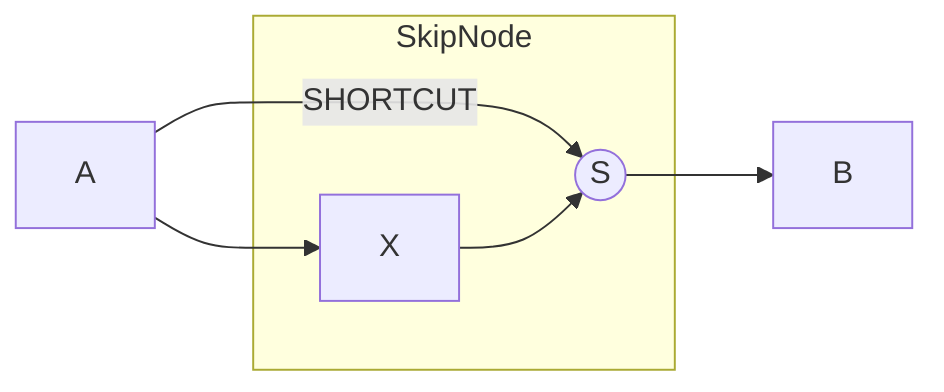
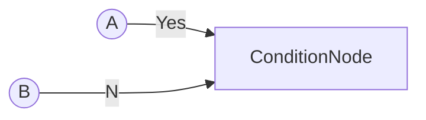
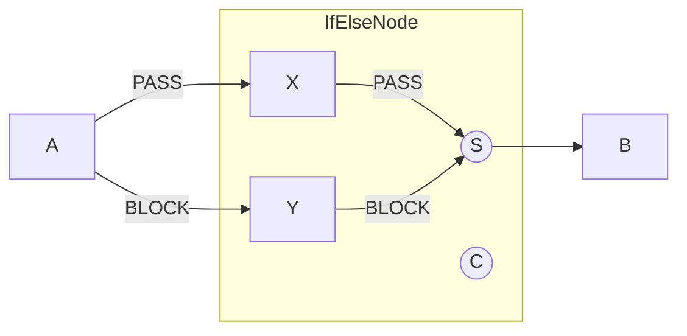
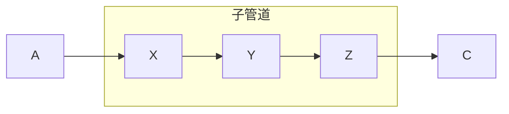
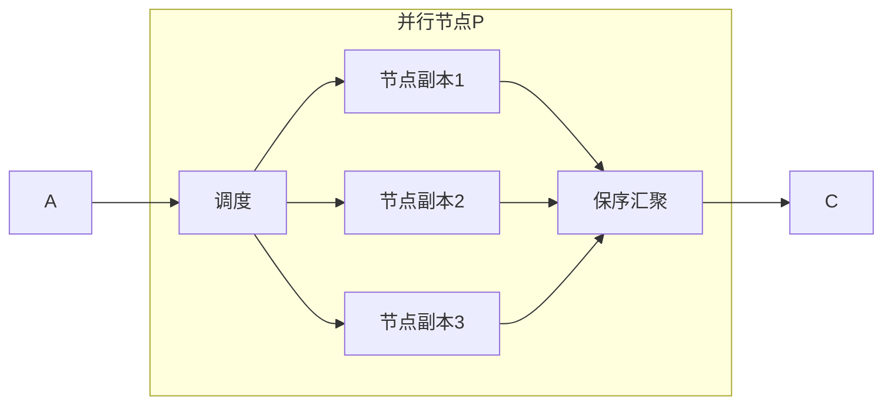
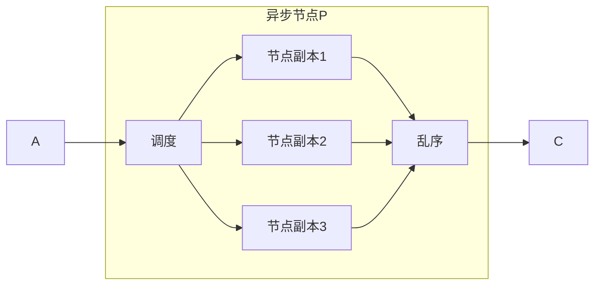
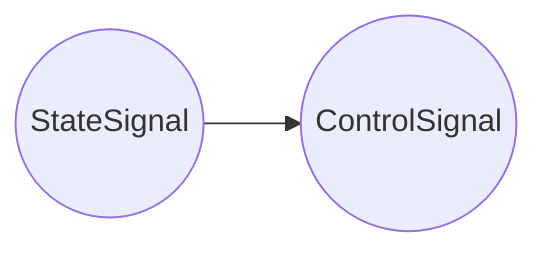
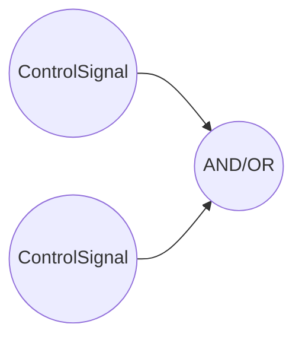

#EAGLEEYE数据流框架的功能性节点
----
####简介
在EAGLEEYE数据流框架下的计算节点分为两个类型，（1）普通节点和（2）功能性节点。普通节点是指所有执行数据处理的节点，包括数据变换处理节点（如ImageTransformNode，等）、算法节点（如ConsistenceNode，SaliencyDetNode，等）。功能性节点是指管理管理数据流框架执行的节点，如条件节点（ConditionNode），异步节点（AsynNode），等。

####功能性节点
#####SkipNode(跳过节点)
SkipNode是一个跳过节点，当其参数置为true后，内部节点跳过。当其参数置为false后，关闭跳过功能，执行内部所有节点。

代码构建如下
```c++
/**
 * @brief configure pipeline plugin
 * 
 */
EAGLEEYE_BEGIN_PIPELINE_INITIALIZE(test)
// 1.step build datasource node
Placeholder<ImageSignal<Array<unsigned char, 3>>>* data_source = new Placeholder<ImageSignal<Array<unsigned char, 3>>>();
data_source->setPlaceholderType(EAGLEEYE_SIGNAL_IMAGE);
data_source->setPlaceholderSource(EAGLEEYE_CAPTURE_STILL_IMAGE);

// 2.step build your algorithm node
// for example:
// InstancePersonSegMRCNNNode* instance_person_seg_node = new InstancePersonSegMRCNNNode("maskrcnn", "GPU");
//
DummyNode* a = new DummyNode();
SkipNode* skip_node = new SkipNode(
    ()[]{
        DummyNode* X = new DummyNode();
        return X;
    }
);
DummyNode* b = new DummyNode();


// 3.step add all node to pipeline
// 3.1.step add data source node
test->add(data_source,"data_source");
// 3.2.step add your algorithm node
// for example:
// test->add(instance_person_seg_node, "instance_person_seg_node");
test->add(a, "a");
test->add(skip_node, "skip_node");
test->add(b, "b");

// 4.step link all node in pipeline
// for example:
// test->bind("data_source",0,"instance_person_seg_node",0);
test->bind("data_source", 0, "a", 0);
test->bind("a",0 , "skip_node",0);
test->bind("skip_node",0,"b",0);

EAGLEEYE_END_PIPELINE_INITIALIZE
```
当”skip_node“节点的skip参数设置为false时，执行内部节点。运行结果日志如下
```
eagleeye D ->   start run execute node (a)
eagleeye I ->   finish run node (DummyNode) -- (a) (5 us)

eagleeye D ->   start run execute node (skip_node)
eagleeye D ->   start run execute node (X)
eagleeye I ->   finish run node (DummyNode) -- (X) (5 us)
eagleeye I ->   finish run node (SkipNode) -- (skip_node) (1 us)

eagleeye D ->   start run execute node (b)
eagleeye I ->   finish run node (DummyNode) -- (b) (5 us)

```
反之设置为true时，不执行内部节点。运行日志如下
```
eagleeye D ->   start run execute node (a)
eagleeye D ->   run in dummy node a

eagleeye I ->   finish run node (DummyNode) -- (a) (194 us)

eagleeye D ->   start run execute node (skip_node)
eagleeye I ->   finish run node (SkipNode) -- (skip_node) (0 us)

eagleeye D ->   start run execute node (b)
eagleeye I ->   finish run node (DummyNode) -- (b) (5 us)

```

#####ConditionNode(条件节点)
ConditionNode是一个条件节点，拥有三个输入信号端口和一个输出信号。第0个输入端口接入条件控制信号(BooleanSignal类型信号)，通过分析获得的条件控制信号是true还是false来决定将第1个输入端口的信号还是第2个输入端口的信号输出出去。拓扑结构见下：


>拓扑结构说明
>圆圈表示节点的输出信号，矩形表示节点

代码构建如下
```c++
/**
 * @brief configure pipeline plugin
 * 
 */
EAGLEEYE_BEGIN_PIPELINE_INITIALIZE(test)
// 1.step build datasource node
Placeholder<ImageSignal<Array<unsigned char, 3>>>* data_source = new Placeholder<ImageSignal<Array<unsigned char, 3>>>();
data_source->setPlaceholderType(EAGLEEYE_SIGNAL_IMAGE);
data_source->setPlaceholderSource(EAGLEEYE_CAPTURE_STILL_IMAGE);

// 2.step build your algorithm node
// for example:
// InstancePersonSegMRCNNNode* instance_person_seg_node = new InstancePersonSegMRCNNNode("maskrcnn", "GPU");
//
DummyNode<ImageSignal<Array<unsigned char, 3>>, ImageSignal<int>>* a = new DummyNode<ImageSignal<Array<unsigned char, 3>>, ImageSignal<int>>();
DummyNode<ImageSignal<Array<unsigned char, 3>>, ImageSignal<int>>* b = new DummyNode<ImageSignal<Array<unsigned char, 3>>, ImageSignal<int>>();
DummyNode<ImageSignal<Array<unsigned char, 3>>, BooleanSignal>* control_node = new DummyNode<ImageSignal<Array<unsigned char, 3>>, BooleanSignal>();
ConditionNode<ImageSignal<int>>* condition_node = new ConditionNode<ImageSignal<int>>();
DummyNode<ImageSignal<int>,ImageSignal<int>>* d = new DummyNode<ImageSignal<int>,ImageSignal<int>>();

// 为a节点设置固定输出 (全1)
a->setFixedOutput(Matrix<int>(2,2,1));
// 为b节点设置固定输出（全2）
b->setFixedOutput(Matrix<int>(2,2,2));
// 设置固定控制信号（输出true，此时条件端口将选择1号信号输出；反之选择2号信号输出）
control_node->setFixedOutput(false);

// 3.step add all node to pipeline
// 3.1.step add data source node
test->add(data_source,"data_source");
// 3.2.step add your algorithm node
// for example:
// test->add(instance_person_seg_node, "instance_person_seg_node");
test->add(a, "a");
test->add(b, "b");
test->add(control_node, "control_node");
test->add(condition_node, "condition_node");
test->add(d, "d");

// 4.step link all node in pipeline
// for example:
// test->bind("data_source",0,"instance_person_seg_node",0);
test->bind("data_source", 0, "a", 0);
test->bind("data_source",0 , "b",0);
test->bind("data_source",0,"control_node",0);
test->bind("control_node", 0, "condition_node", 0);
test->bind("a", 0, "condition_node", 1);
test->bind("b", 0, "condition_node", 2);
test->bind("condition_node",0,"d",0);

EAGLEEYE_END_PIPELINE_INITIALIZE
```
控制节点"control_node"的输出信号为BooleanSignal类型，其携带的信号为true时，条件节点"condition_node"选择1号端口的信号输出；反之控制信号输出的值为false时，条件节点"condition_node"选择2号端口的信号输出。
上面代码输出日志为
```
eagleeye D ->   start run execute node (a)
eagleeye D ->   run in dummy node a
eagleeye D ->   input data
...
eagleeye D ->   output data
1       1
1       1
eagleeye I ->   finish run node (DummyNode) -- (a) (130 us)

eagleeye D ->   start run execute node (b)
eagleeye D ->   run in dummy node b
eagleeye D ->   input data
...
eagleeye D ->   output data
2       2
2       2
eagleeye I ->   finish run node (DummyNode) -- (b) (208 us)

eagleeye D ->   start run execute node (condition_node)
eagleeye I ->   finish run node (ConditionNode) -- (condition_node) (1 us)

eagleeye D ->   start run execute node (d)
eagleeye D ->   run in dummy node d
eagleeye D ->   input data
2       2
2       2
eagleeye D ->   output data
eagleeye I ->   finish run node (DummyNode) -- (d) (10 us)

```

#####IfElseNode
IfElseNode是选择节点，根据控制信号自动选择执行的管道分支路线。IfElseNode在第0端口接入控制信号，其余端口接入上游信号（端口可数任意）。IfElseNode将根据在第0端口接入的控制信号的输出true/false，判断将输入上游节点的输出对接到IfElseNode内的对应分支并运行输出。如果控制信号输出true，则运行分支x；如果控制信号输出false，则运行分支y。

拓扑结果见下：

>拓扑结构说明
>圆圈表示节点的输出信号，矩形表示节点

代码构建如下
```c++
/**
 * @brief configure pipeline plugin
 * 
 */
EAGLEEYE_BEGIN_PIPELINE_INITIALIZE(test)
// 1.step build datasource node
Placeholder<ImageSignal<Array<unsigned char, 3>>>* data_source = new Placeholder<ImageSignal<Array<unsigned char, 3>>>();
data_source->setPlaceholderType(EAGLEEYE_SIGNAL_IMAGE);
data_source->setPlaceholderSource(EAGLEEYE_CAPTURE_STILL_IMAGE);

// 2.step build your algorithm node
// for example:
// InstancePersonSegMRCNNNode* instance_person_seg_node = new InstancePersonSegMRCNNNode("maskrcnn", "GPU");
//
DummyNode<ImageSignal<Array<unsigned char, 3>>,ImageSignal<int>>* a = new DummyNode<ImageSignal<Array<unsigned char, 3>>,ImageSignal<int>>();

DummyNode<ImageSignal<int>,ImageSignal<int>>* x = new DummyNode<ImageSignal<int>,ImageSignal<int>>();
DummyNode<ImageSignal<int>,ImageSignal<int>>* y = new DummyNode<ImageSignal<int>,ImageSignal<int>>();
IfElseNode* ifelsenode = new IfElseNode(x,y);
DummyNode<ImageSignal<Array<unsigned char, 3>>, BooleanSignal>* c = new DummyNode<ImageSignal<Array<unsigned char, 3>>, BooleanSignal>();
DummyNode<ImageSignal<int>,ImageSignal<int>>* b = new DummyNode<ImageSignal<int>,ImageSignal<int>>();

// 为控制节点设置固定输出(输出true时，IFELSE节点将选在x节点运行；输出false时，IFELSE节点将选择y节点运行)
c->setFixedOutput(false);

// 3.step add all node to pipeline
// 3.1.step add data source node
test->add(data_source,"data_source");
// 3.2.step add your algorithm node
// for example:
// test->add(instance_person_seg_node, "instance_person_seg_node");
test->add(a, "a");
test->add(ifelsenode, "IFELSE");
test->add(c, "control_node");
test->add(b, "b");

// 4.step link all node in pipeline
// for example:
// test->bind("data_source",0,"instance_person_seg_node",0);
test->bind("data_source", 0, "a", 0);
test->bind("data_source",0,"control_node",0);

test->bind("control_node", 0, "IFELSE",0);
test->bind("a", 0, "IFELSE",1);
test->bind("IFELSE",0,"b",0);

EAGLEEYE_END_PIPELINE_INITIALIZE

```
上面代码输出日志

```
eagleeye D ->   start run execute node (control_node)
eagleeye D ->   run in dummy node control_node
eagleeye I ->  finish run node (DummyNode) -- (control_node) (136 us)

eagleeye D ->   start run execute node (a)
eagleeye D ->   run in dummy node a
eagleeye I ->   finish run node (DummyNode) -- (a) (386 us)

eagleeye D ->   start run execute node (IFELSE)
eagleeye D ->   start run execute node (AnyNode:y)
eagleeye D ->   run in dummy node AnyNode:y
eagleeye I ->   finish run node (DummyNode) -- (AnyNode:y) (4 us)

eagleeye I ->   finish run node (IfElseNode) -- (IFELSE) (12 us)

eagleeye D ->   start run execute node (b)
eagleeye D ->   run in dummy node b
eagleeye I ->   finish run node (DummyNode) -- (b) (4 us)

```


#####SubPipeline(子管道节点)
子管道节点是指一系列节点连接的组合，拓扑结构见下：

构建代码如下
```c++
/**
 * @brief configure pipeline plugin
 * 
 */
EAGLEEYE_BEGIN_PIPELINE_INITIALIZE(test)
// 1.step build datasource node
Placeholder<ImageSignal<Array<unsigned char, 3>>>* data_source = new Placeholder<ImageSignal<Array<unsigned char, 3>>>();
data_source->setPlaceholderType(EAGLEEYE_SIGNAL_IMAGE);
data_source->setPlaceholderSource(EAGLEEYE_CAPTURE_STILL_IMAGE);

// 2.step build your algorithm node
// for example:
// InstancePersonSegMRCNNNode* instance_person_seg_node = new InstancePersonSegMRCNNNode("maskrcnn", "GPU");
//
DummyNode<ImageSignal<Array<unsigned char, 3>>,ImageSignal<int>>* a = new DummyNode<ImageSignal<Array<unsigned char, 3>>,ImageSignal<int>>();

SubPipeline* subpipeline = new SubPipeline();
DummyNode<ImageSignal<int>,ImageSignal<int>>* x = new DummyNode<ImageSignal<int>,ImageSignal<int>>();
DummyNode<ImageSignal<int>,ImageSignal<int>>* y = new DummyNode<ImageSignal<int>,ImageSignal<int>>();
DummyNode<ImageSignal<int>,ImageSignal<int>>* z = new DummyNode<ImageSignal<int>,ImageSignal<int>>();
subpipeline->add(x, "x", SOURCE_NODE);// 加入节点x，并命名为x
subpipeline->add(y, "y");// 加入节点y，并命名为y
subpipeline->add(z, "z", SINK_NODE);// 加入节点z，并命名为z
subpipeline->bind("SOURCE",0,"x",0);    //关联子管道的源连接到节点x
subpipeline->bind("x",0,"y",0);         //关联节点x连接到节点y
subpipeline->bind("y",0,"z",0);         //关联节点x连接到节点y
subpipeline->bind("z",0,"SINK",0);      //关联节点y连接到节点z

DummyNode<ImageSignal<int>,ImageSignal<int>>* c = new DummyNode<ImageSignal<int>,ImageSignal<int>>();

// 3.step add all node to pipeline
// 3.1.step add data source node
test->add(data_source,"data_source");
// 3.2.step add your algorithm node
// for example:
// test->add(instance_person_seg_node, "instance_person_seg_node");
test->add(a, "a");
test->add(subpipeline, "S");
test->add(c, "c");

// 4.step link all node in pipeline
// for example:
// test->bind("data_source",0,"instance_person_seg_node",0);
test->bind("data_source", 0, "a", 0);
test->bind("a",0,"S",0);
test->bind("S",0,"c",0);

EAGLEEYE_END_PIPELINE_INITIALIZE
```
运行上面代码输出日志

```
eagleeye D ->   start run execute node (a)
eagleeye D ->   run in dummy node a
eagleeye I ->   finish run node (DummyNode) -- (a) (137 us)

eagleeye D ->   start run execute node (S)
eagleeye D ->   start run execute node (x)
eagleeye D ->   run in dummy node x
eagleeye I ->   finish run node (DummyNode) -- (x) (5 us)

eagleeye D ->   start run execute node (y)
eagleeye D ->   run in dummy node y
eagleeye I ->   finish run node (DummyNode) -- (y) (5 us)

eagleeye D ->   start run execute node (z)
eagleeye D ->   run in dummy node z
eagleeye I ->   finish run node (DummyNode) -- (z) (5 us)

eagleeye I ->   finish run node (SubPipeline) -- (S) (33 us)

eagleeye D ->   start run execute node (c)
eagleeye D ->   run in dummy node c
eagleeye I ->   finish run node (DummyNode) -- (c) (4 us)
```

#####ParallelNode(并行节点)
并行节点是指，依靠多线程执行内部控制的节点，在执行时拥有保序性。接入的上游信号需要是队列信号，在执行时自动从上游队列信号中抓取数据，送入多线程中执行，并保存到输出队列中。拓扑结构见下：


代码构建如下：
```c++
/**
 * @brief configure pipeline plugin
 * 
 */
EAGLEEYE_BEGIN_PIPELINE_INITIALIZE(test)
// 1.step build datasource node
// placeholder队列信号
Placeholder<ImageSignal<Array<unsigned char, 3>>>* data_source = new Placeholder<ImageSignal<Array<unsigned char, 3>>>(true);
data_source->setPlaceholderType(EAGLEEYE_SIGNAL_IMAGE);
data_source->setPlaceholderSource(EAGLEEYE_CAPTURE_STILL_IMAGE);

// 2.step build your algorithm node
// for example:
// InstancePersonSegMRCNNNode* instance_person_seg_node = new InstancePersonSegMRCNNNode("maskrcnn", "GPU");
//
DummyNode<ImageSignal<Array<unsigned char, 3>>,ImageSignal<int>>* a = new DummyNode<ImageSignal<Array<unsigned char, 3>>,ImageSignal<int>>();

ParallelNode* parallel_node = new ParallelNode(3, [](){
    // 启动3个线程，每个线程维护一个X节点的副本
    // 并行节点的执行拥有保序性，也就是说顺序输入数据将获得顺序输出结果
    DummyNode<ImageSignal<int>,ImageSignal<int>>* x = new DummyNode<ImageSignal<int>,ImageSignal<int>>();

    return x;
});

DummyNode<ImageSignal<int>,ImageSignal<int>>* c = new DummyNode<ImageSignal<int>,ImageSignal<int>>();

// 3.step add all node to pipeline
// 3.1.step add data source node
test->add(data_source,"data_source");
// 3.2.step add your algorithm node
// for example:
// test->add(instance_person_seg_node, "instance_person_seg_node");
test->add(a, "a");
test->add(parallel_node, "P");
test->add(c, "c");

// 4.step link all node in pipeline
// for example:
// test->bind("data_source",0,"instance_person_seg_node",0);
test->bind("data_source", 0, "a", 0);
test->bind("a",0,"P",0);
test->bind("P",0,"c",0);

EAGLEEYE_END_PIPELINE_INITIALIZE
```

我们看一下ParallelNode的类的定义
```c++
class ParallelNode:public AnyNode{
public:
    ParallelNode(int thread_num, std::function<AnyNode*()> generator);

    ...
};
```
其中构造函数的第一个参数thread_num，表明启动的线程数；第二个参数generator，依靠lambda函数创建待并行的计算节点。在ParallelNode构造函数中，通过设置的线程数使用generator生成待并行计算的节点副本。在管线运行时，每个节点副本并行处理传进来的数据。


#####AutoNode(自动节点)
自动驱动节点同并性节点类似，主动抓取上游队列信号中的数据并送入独立线程中进行执行，并将输出数据保存到输出队列中。可以看做是线程个数为1的并行节点。
构建代码
```c++
AutoNode* auto_node = new AutoNode(
    [](){
        DummyNode* nn = new DummyNode();
        return nn;
});
```

#####AsynNode(异步节点)
不同于并行节点和自动节点，异步节点属于被动式驱动多线程获取数据并执行。在整个管线外部驱动运行时，将数据送入多线程执行。同时从此节点获取的数据，是在此时刻的已经处理完成的最新数据。由于非阻塞执行，从而不可以保证每次从异步节点都能取到数据。

拓扑结构见下：

代码构建如下：
```c++
/**
 * @brief configure pipeline plugin
 * 
 */
EAGLEEYE_BEGIN_PIPELINE_INITIALIZE(test)
// 1.step build datasource node
Placeholder<ImageSignal<Array<unsigned char, 3>>>* data_source = new Placeholder<ImageSignal<Array<unsigned char, 3>>>();
data_source->setPlaceholderType(EAGLEEYE_SIGNAL_IMAGE);
data_source->setPlaceholderSource(EAGLEEYE_CAPTURE_STILL_IMAGE);

// 2.step build your algorithm node
// for example:
// InstancePersonSegMRCNNNode* instance_person_seg_node = new InstancePersonSegMRCNNNode("maskrcnn", "GPU");
//
DummyNode<ImageSignal<Array<unsigned char, 3>>,ImageSignal<int>>* a = new DummyNode<ImageSignal<Array<unsigned char, 3>>,ImageSignal<int>>();

AsynNode* asyn_node = new AsynNode(2, [](){
    // 启动2个线程，每个线程维护一个X节点的副本
    // 无保序性，也就谁说顺序输出的数据，无法保证同样顺序输出
    DummyNode<ImageSignal<int>,ImageSignal<int>>* x = new DummyNode<ImageSignal<int>,ImageSignal<int>>();

    return x;
}, 1);

DummyNode<ImageSignal<int>,ImageSignal<int>>* c = new DummyNode<ImageSignal<int>,ImageSignal<int>>();

// 3.step add all node to pipeline
// 3.1.step add data source node
test->add(data_source,"data_source");
// 3.2.step add your algorithm node
// for example:
// test->add(instance_person_seg_node, "instance_person_seg_node");
test->add(a, "a");
test->add(asyn_node, "P");
test->add(c, "c");

// 4.step link all node in pipeline
// for example:
// test->bind("data_source",0,"instance_person_seg_node",0);
test->bind("data_source", 0, "a", 0);
test->bind("a",0,"P",0);
test->bind("P",0,"c",0);

EAGLEEYE_END_PIPELINE_INITIALIZE
```
我们看一下AsynNode的构造函数：
```c++
class AsynNode:public AnyNode{
public:
    AsynNode(int thread_num, std::function<AnyNode*()> generator, int input_queue_size=1, int output_queue_size=1);

    ...
}；
```

其中第一个参数thread_num，设置多线程数；第二个参数generator，依靠lambda函数创建待并行的计算节点；第三个参数是内部维护的输入队列大小；第四个参数是内部维护的输出队列大小。输出队列是优先队列，保证最新处理结果位于队列头部。

#####QueueNode(队列节点)
将数据推入同类型队列信号。通常用于对接并行节点（ParallelNode）或自动节点（AutoNode）。
构建代码如下
```c++
QueueNode* qn = new QueueNode();
// 将上游信号连接入qn第0端口
// 在pipeline run时，将上游信号送入qn维护的队列信号中，共下游节点使用（通常下游节点为并行节点和自动节点）。
qn->setInputPort(..., 0);
```

#####State2BooleanNode(状态转控制)
将状态信号转换为控制信号。通过设置状态到true/false的映射关系，实现根据数据处理的需求，生成控制信号。

构建代码如下
```c++
std::map<int, bool> tracking_state_map;
tracking_state_map[0] = false;      // 状态0映射为false
tracking_state_map[1] = true;       // 状态1映射为true
State2BooleanNode* tracking_state_feadback = new State2BooleanNode(tracking_state_map);

```

#####LogicalNode(逻辑节点)
实现控制信号的逻辑控制。接收两个控制信号，根据指定的与、或算子，实现输出。


