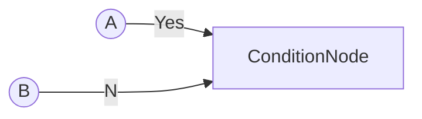
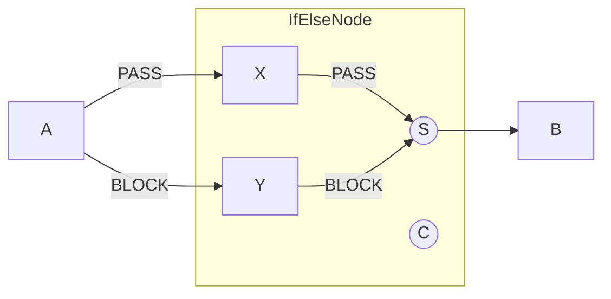
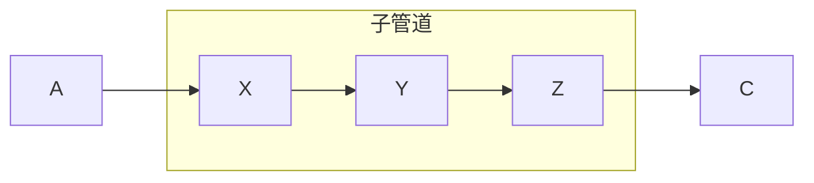
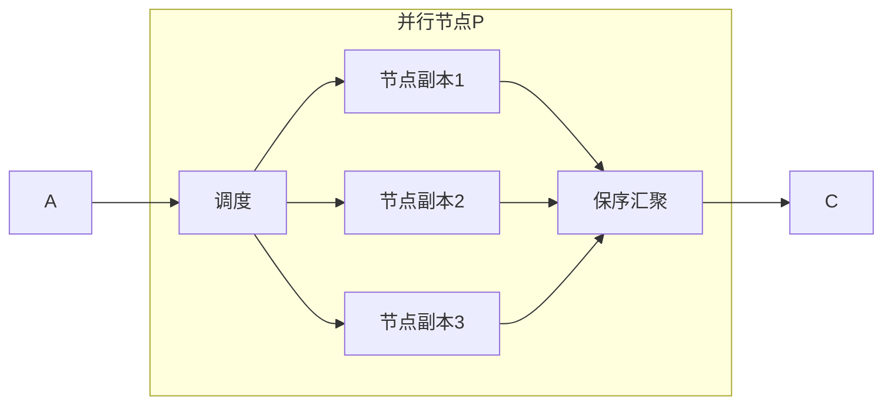
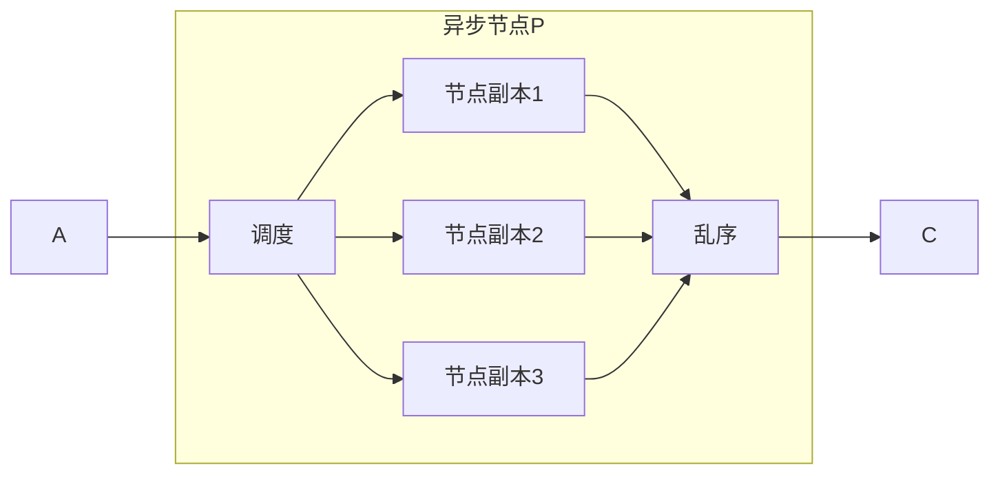

#EAGLEEYE数据流框架的功能性节点
----
####简介
在EAGLEEYE数据流框架下的计算节点分为两个类型，（1）普通节点和（2）功能性节点。普通节点是指所有执行数据处理的节点，包括数据变换处理节点（如ImageTransformNode，等）、算法处理节点（如ConsistenceNode，SaliencyDetNode，等）。功能性节点是指管理管理数据流框架执行的节点，如条件节点（ConditionNode），异步节点（AsynNode），等。

####功能性节点
#####ConditionNode(条件节点)
ConditionNode是一个条件节点，拥有三个输入信号端口和一个输出信号。第0个输入端口接入条件控制信号(BooleanSignal类型信号)，通过分析获得的条件控制信号是True还是False来决定将第1个输入端口的信号还是第2个输入端口的信号输出出去。拓扑结构见下：


>拓扑结构说明
>圆圈表示节点的输出信号，矩形表示节点

代码构建如下
```c++
    ConditionNode* condition_node = new ConditionNode();
    A* a_node = new A();
    B* b_node = new B();
    
    // 控制节点通过输出BooleanSignal来控制条件节点选择A节点输出还是B节点输出通过
    C* control_node = new C();
    
    AnyPipeline* pipeline = new AnyPipeline();
    pipeline->add(a_node, "A");                     //加入节点A到管道
    pipeline->add(b_node, "B");                     //加入节点B到管道
    pipeline->add(c_node, "C");                     //加入节点C到管道
    pipeline->add(condition_node, "Condition");     //加入条件节点Condition到管道

    pipeline->bind("C",0,"Condition",0);        // 条件节点第0个端口接入条件信号
    pipeline->bind("A",0,"Condition",1);        // 条件节点第1个端口接入 True 信号（当条件信号为True时，此端口信号输出）
    pipeline->bind("B",0,"condition",2);        // 条件节点第2个端口接入 False 信号（当条件信号为Fasle时，此端口信号输出）
```
#####IfElseNode
IfElseNode是开关节点，根据控制信号自动选择执行的管道分支路线。拓扑结果见下：

>拓扑结构说明
>圆圈表示节点的输出信号，矩形表示节点

代码构建如下
```c++
    A* a_node = new A();    // 上游节点
    B* b_node = new B();    // 下游节点
    C* c_node = new C();    // 输出控制信号的节点

    X* x_node = new X();    // 在IfElse里控制的分支1
    Y* y_node = new Y();    // 在IfElse里控制的分支2
    IfElseNode* ifelse_node = new IfElseNode(x_node,y_node);

    AnyPipeline* pipeline = new AnyPipeline();
    pipeline->add(a_node, "A");             //加入节点A到管道
    pipeline->add(b_node, "B");             //加入节点B到管道
    pipeline->add(c_node, "C");             //加入输出控制信号的节点C到管道
    pipeline->add(ifelse_node, "IFELSE");   //加入IfElse节点
    
    pipeline->bind("C",0,"IFELSE",0);       //将节点C的输出控制信号接入IFELSE节点的0号端口。IFELSE节点将根据控制信号的输出决定执行的分支(X节点/Y节点)。
    pipeline->bind("A",0,"IFELSE",1);       //将上游节点A关联到IFELSE的1号端口。IFELSE动态将此端口上的信息传递到选择的分支。
    pipeline->bind("IFELSE",0,"B",0);       //将IFELSE节点选择的分支的输出作为信号接入节点B的输入端口

```


#####SubPipeline(子管道节点)
子管道节点是指一系列节点连接的组合，拓扑结构见下：

构建代码如下
```c++
    SubPipeline* subpipeline = new SubPipeline();
    X* x_node = new X();
    Y* y_node = new Y();
    Z* z_node = new Z();

    subpipeline->add(x_node, "X");  // 加入节点x_node，并命名为X
    subpipeline->add(y_node, "Y");  // 加入节点y_node，并命名为Y
    subpipeline->add(z_node, "Z");  // 加入节点z_node，并命名为Z

    subpipeline->bind("SOURCE", 0, "X", 0); //关联子管道的源连接到节点X
    subpipeline->bind("X",0,"Y",0);         //关联节点X到节点Y
    subpipeline->bind("Y",0,"Z",0);         //关联节点Y到节点Z
    subpipeline->bind("Z",0, "SINK",0);     //关联节点Z到自管道的灭

    A* a_node = new A();
    C* c_node = new C();

    AnyPipeline* pipeline = new AnyPipeline();
    pipeline->add(a_node, "A");         //加入节点A到管道
    pipeline->add(subpipeline, "S");    //加入自管道到管道
    pipeline->add(c_node, "C");         //加入节点C到管道

    pipeline->bind("A",0,"S",0);
    pipeline->bind("S",0,"C",0);
```

#####ParallelNode(并行节点)
并行节点是指，依靠多线程执行内部控制的节点，在执行时拥有保序性。拓扑结构见下：


代码构建如下：
```c++
    ParallelNode* parallel_node = new ParallelNode(2, 3, [](){
        // 启动3个线程，每个线程维护一个X节点的副本
        // 并行节点的执行拥有保序性，也就是说顺序输入数据将获得顺序输出结果
        X* x_node = new X();
        return x_node;
    });
    AnyPipeline* pipeline = new AnyPipeline();
    pipeline->add(a_node, "A");             //加入节点A到管道
    pipeline->add(parallel_node, "P");      //加入并行节点到管道
    pipeline->add(c_node, "C");             //加入节点C到管道

    pipeline->bind("A",0,"P",0);
    pipeline->bind("P",0,"C",0);
```

我们看一下ParallelNode的类的定义
```c++
class ParallelNode:public AnyNode{
public:
    ParallelNode(int delay_time, int thread_num, std::function<AnyNode*()> generator);

    ...
};
```
其中构造函数的第一个参数是delay_time，表明在并行节点压入delay_time个数据后允许获取数据；第二个参数thread_num，表明启动的线程数；第三个参数generator，表明控制的节点。设置几个线程，便会构建几个节点的副本。

#####AsynNode(异步节点)
异步节点是指，依靠多线程执行内部维护的节点，在执行时无法保证每次获取结果都能得到。拓扑结构见下：

代码构建如下：
```c++
   AsynNode* parallel_node = new AsynNode(3, [](){
        // 启动3个线程，每个线程维护一个X节点的副本
        // 并行节点的执行拥有保序性，也就是说顺序输入数据将获得顺序输出结果
        X* x_node = new X();
        return x_node;
    }, 1);
    AnyPipeline* pipeline = new AnyPipeline();
    pipeline->add(a_node, "A");             //加入节点A到管道
    pipeline->add(parallel_node, "P");      //加入并行节点到管道
    pipeline->add(c_node, "C");             //加入节点C到管道

    pipeline->bind("A",0,"P",0);
    pipeline->bind("P",0,"C",0);
```
我们看一下AsynNode的构造函数：
```c++
class AsynNode:public AnyNode{
public:
    AsynNode(int thread_num, std::function<AnyNode*()> generator, int queue_size=1);

    ...
};
```

其中第一个参数thread_num设置多线程数，第二个参数generator设置控制的节点，第三个参数queue_size设置队列大小。内部队列使用维护最新获得的处理结果。