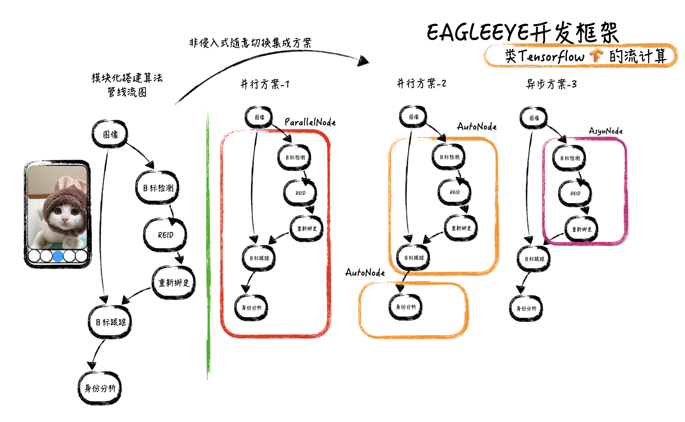

# EAGLEEYE图像应用开发框架

#### 简介

EAGLEEYE图像应用开发框架针对于快速将图像算法推向落地而设计。依靠统一通用的模块接口定义和数据流管线架构设计，极度简化团队协同开发。

#### EAGLEEYE核心库编译(可选)
编译移动端EAGLEEYE库
```c++
bash build.sh
```

> 注意：需要提前安装Android NDK，并创立 ANDROID_NDK_HOME 环境变量

#### 安装EAGLEEYE项目脚手架
安装脚手架
```shell
cd scripts
pip3 install -r requirements.txt
python3 setup.py install
```

#### 创建第一个项目
```shell
eagleeye-cli project --project=PLUGIN_NAME      \\ 定义要生成的插件名字
            --version=1.0.0.0                   \\ 定义插件版本
            --signature=xxxxx                   \\ 定义插件签名（目前未启用）
            --build_type=Release                \\ 定义编译版本
            --opencv=OPENCV_PATH                \\ 定义opencv路径(选择性设置)
            --abi=arm64-v8a                     \\ 定义abi
            --eagleeye=EAGLEEYE_PATH            \\ 定义eagleeye路径
            --host_platform=MACOS               \\ 设置主机平台（MACOS/LINUX）
```
运行后将生成模板工程。如果您使用的是VSCODE编辑器，那么脚手架将生成工程配置信息。

工程目录结构如下
```
PLUGIN_NAME
    - .vscode
        - c_cpp_properties.json
        - cmake-kits.json
        - settings.json
        - tasks.json
    - PLUGIN_NAME_plugin.h              // 插件头文件
    - PLUGIN_NAME_plugin.cpp            // 插件源文件
    - PLUGIN_NAME_demo.cpp              // 可执行程序，用于测试插件
    - CMakeLists.txt
    - build.sh                          // 构建&编译插件和可执行程序，并安装
    - run.sh                            // 运行可执行程序
    - package                           // 插件包（编译后，将把生成的插件.so放置于此处）
        - resource
            - config.json
        xxx.so
```

#### 编写第一个管线插件
实现c=a+b功能，在PLUGIN_NAME_plugin.cpp文件中

```c++
#include "eagleeye/processnode/Placeholder.h"
#include "eagleeye/processnode/Add.h"
#include "eagleeye/framework/pipeline/SignalFactory.h"

namespace eagleeye{
// 注册算法管线
EAGLEEYE_PIPELINE_REGISTER(PLUGIN_NAME, 1.0.0.0, xxxxx);

// 初始换算法管线
EAGLEEYE_BEGIN_PIPELINE_INITIALIZE(PLUGIN_NAME)
// 第一步：建立占位符节点
Placeholder<ImageSignal<float>>* placeholder_a = 
                    new Placeholder<ImageSignal<float>>();
Placeholder<ImageSignal<float>>* placeholder_b = 
                    new Placeholder<ImageSignal<float>>();

// 第二步：建立加操作节点
Add<ImageSignal<float>,ImageSignal<float>>* add = 
    new Add<ImageSignal<float>,ImageSignal<float>>();

// 第三步：将节点加入管线
PLUGIN_NAME->add(placeholder_a,"placeholder_a");
PLUGIN_NAME->add(placeholder_b,"placeholder_b");
PLUGIN_NAME->add(add,"add");

// 第四步：建立节点间的关系（a->c,b->c）
// 实现 c=a+b
PLUGIN_NAME->bind("placeholder_a",0,"add",0);
PLUGIN_NAME->bind("placeholder_b",0,"add",1);
EAGLEEYE_END_PIPELINE_INITIALIZE
```

#### 编写第一个测试代码
在PLUGIN_NAME_demo.cpp文件中
```c++
    // 1.step initialize PLUGIN_NAME module
    const char *config_folder = NULL;   // PLUGIN_NAME module configure folder
    eagleeye_PLUGIN_NAME_initialize(config_folder);

    // 2.step set input of pipeline
    float *a_data = (float*)malloc(sizeof(float)*10*10);
    for(int i=0; i<10*10; ++i){
        a_data[i] = 1.0f;
    }
    int a_data_size[] = {10, 10, 1};
    eagleeye_PLUGIN_NAME_set_input("placeholder_a/0", (void*)a_data, a_data_size, 3, 0, 6);

    float *b_data = (float*)malloc(sizeof(float)*10*10);
    for(int i=0; i<10*10; ++i){
        b_data[i] = 2.0f;
    }
    int b_data_size[] = {10, 10, 1};
    eagleeye_PLUGIN_NAME_set_input("placeholder_b/0", (void*)b_data, b_data_size, 3, 0, 6);

    // 3.step run pipeline
    eagleeye_PLUGIN_NAME_run();

    // 4.step get output from pipeline
    void *out_data;
    int out_data_size[3];
    int out_data_dims = 3;
    int out_data_type = 6;
    eagleeye_PLUGIN_NAME_get_output("add/0", out_data, out_data_size, out_data_dims,out_data_type);
    float* out_data_float = (float*)out_data;

    // 5.step release PLUGIN_NAME module
    eagleeye_PLUGIN_NAME_release();
```

#### 编译
* VSCODE开发环境
    * 按下SHIFT + COMMAND + P，选择CMAKE: Configure。
        如果提示Select a kit for ...，则选择Android Clang。然后继续进行CMAKE: Configure。
    * 按下SHIFT + COMMAND + P，选择CMAKE: Build。
* 控制台
    运行 bash ./build.sh

#### 运行
运行前，确保手机已经连接，并开启USB调试状态
* VSCODE开发环境
    * 按下SHIFT + COMMAND + P，选择Tasks: Run Task。
    * 在弹出的任务列表中，选择 PLUGIN_NAME run，便可执行。
* 控制台
    运行 bash ./run.sh

> 项目文件夹，由运行脚本自动生成，位于
> /data/local/tmp/PLUGIN_NAME
> 所有依赖库和可执行程序均自动放置于此文件夹下。